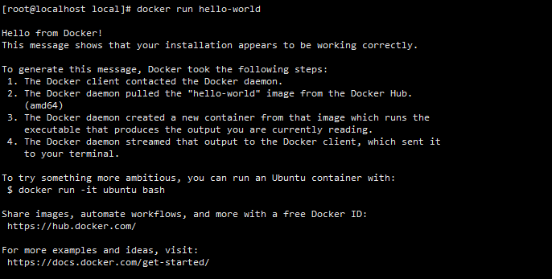

# Docker快速入门


## 1安装教程

### 1.1卸载旧版本

```shell script
yum remove docker \
                  docker-client \
                  docker-client-latest \
                  docker-common \
                  docker-latest \
                  docker-latest-logrotate \
                  docker-logrotate \
                  docker-engine
```

### 1.2安装需要的软件包

```shell script
yum install -y yum-utils
```

### 1.3添加镜像源

```shell script
yum-config-manager --add-repo https://download.docker.com/linux/centos/docker-ce.repo			#官网镜像

yum-config-manager --add-repo http://mirrors.aliyun.com/docker-ce/linux/centos/docker-ce.repo   #阿里镜像
```

### 1.4安装docker客户端

```shell
yum install docker-ce docker-ce-cli containerd.io
```

### 1.5启动docker

``` shell
systemctl start docker 
```


### 1.6开始HelloWorld

运行**docker run hello-world**，出现如下所示：




## 2镜像命令

- 查找一个镜像

```shell
docker search nginx
```


- 拉取镜像

```shell
docker pull nginx
```


- 查看所有镜像

```shell
docker images
```

**说明**：**REPOSITORY：**表示镜像的仓库源

​			**TAG：**镜像的标签

​			**IMAGE ID：**镜像ID

​			**CREATED：**镜像创建时间

​			**SIZE：**镜像大小


- 运行镜像

```
docker run [选项] NAME|ID
```

**选项**： -p 端口映射      本机端口:容器端口

​			-v 数据卷挂载    本机目录:容器目录

​			--name 别名     给容器取个别名


- 删除镜像

```shell
docker rmi [选项] NAME|ID
```

**选项：** -f 强制删除镜像


- 设置镜像标签

```shell
  docker tag [镜像id] 用户名/镜像预源名：新标签名
```


## 3容器命令

- 查看正在运行的容器

```shell
docker ps [选项]
```

 **选项**：-a 查看所有容器

​			-q 只显示容器id


**说明**：CONTAINER ID：容器id

​			IMAGE： 对应的镜像

​			COMMAND：启动容器时运行的命令

​			CREATED： 容器创建的时间

​			STATUS： 容器状态

​			PROTS： 端口映射

​			NAMES： 容器别名


- 进入容器

```shell
docker exec -it NAME|ID /bin/bash
```

**选项**： -i 与交互模式运行

​			-t :分配一个伪终端


- 查看容器日志

```shell
docker logs NAME|ID
```


- 删除容器

```shell
docker rm [选项] NAME|ID
```

**选项**： -f 强制删除


- 停止运行容器

```
docker stop NAME|ID
```


- 启动容器

```
docker start NAME|ID
```


- 重启容器

```shell
docker restart NAME|ID
```


- 查看容器的配置信息等

```shell
docker inspect NAME|ID
```


## 4其他命令

- 查看版本信息

```
docker version
```


- 显示docker系统信息

```
docker info
```


- 帮助命令，查看命令可选项

```
docker [命令] --help
```

