[TOC]

# Idea之Docker插件一键部署war包


## 一.Docker开启远程访问

我们要想通过 Idea 的插件远程访问 Docker，需先修改相应的配置信息。

### 1.编辑 docker.service 文件

由于各版本原因，docker.service 文件的位置可能不尽相同，我们先通过：`systemctl status docker` 找到该文件的位置：

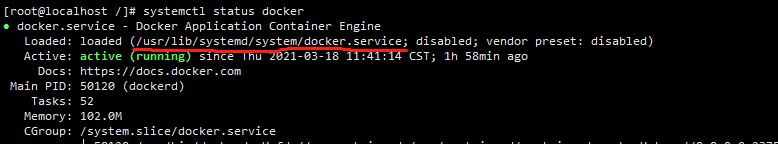


编辑 docker.service 文件

```shell
vi /user/lib/systemd/system/docker/service
```

找到 [Service] 节点的 ExecStart 属性，在末尾加上：`-H tcp://0.0.0.0:2375`。

最终结果为（相当于开放 2375 端口号）：

```shell
ExecStart=/usr/bin/dockerd -H fd:// --containerd=/run/containerd/containerd.sock -H tcp://0.0.0.0:2375
```

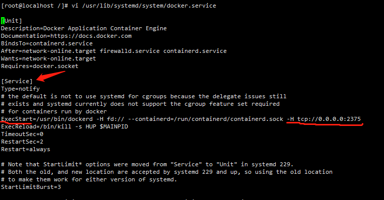

### 2.重新加载 docker 配置

```shell
systemctl daemon-reload
systemctl restart docker 
```

接着通过浏览器访问测试一下，格式为 `http://ip:2375/version`

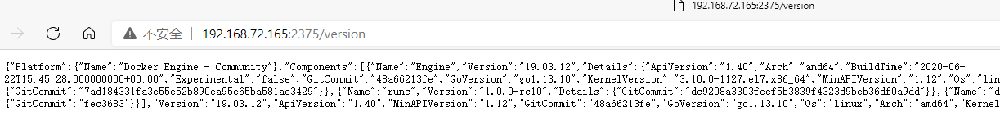


**注意：**如果无法访问，可以尝试以下两条命令，开放防火墙 2375 端口：

```
firewall-cmd --zone=public --add-port=2375/tcp --permanent
firewall-cmd --reload
```

注意，以上两步不能用于生产环境，这相当于直接对外暴露docker，在生产环境是相当危险的命令。关于如何配置 Docker 安全访问，官网提供了基于 CA 证书加密的方法，[Docker 安全访问](https://docs.docker.com/engine/security/protect-access/)


## 二.准备一个  war 包项目

本人用的 Idea 为 2020.3 版本，自带docker插件，如果没有的话可以 `Alt + Ctrl + s` 在 Plugins 中搜索 docker 插件下载。

### 1.新建 SpringBoot war 包项目

步骤很简单，直接照着 idea 新建项目的步骤即可，目录结构如下，需继承 `SpringBootServletInitializer` 类：

（此处提前打了包，可以看到 war 包的路径，方便后面写 Dockerfile 文件）

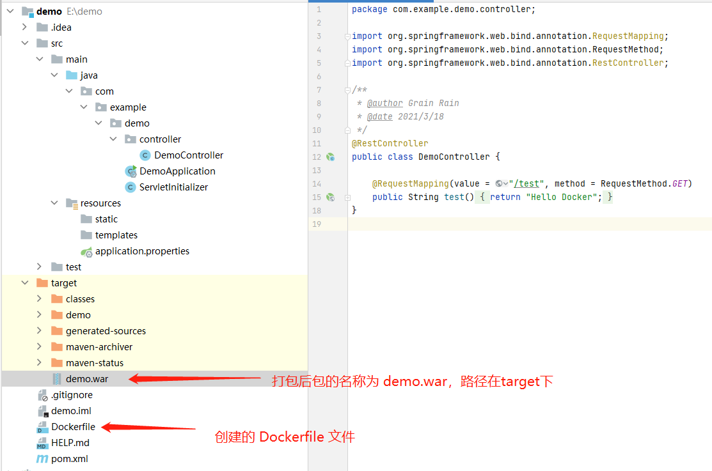

pom.xml 如下，主要注意2点:

- <packaging>标签打包写war；
- <build>标签中加上 `<finalName>demo</finalName>`，此标签目的为打出来的包名直接为 demo.war，而不是 artifactId+version .war的形式。

```xml
<?xml version="1.0" encoding="UTF-8"?>
<project xmlns="http://maven.apache.org/POM/4.0.0" xmlns:xsi="http://www.w3.org/2001/XMLSchema-instance"
         xsi:schemaLocation="http://maven.apache.org/POM/4.0.0 https://maven.apache.org/xsd/maven-4.0.0.xsd">
    <modelVersion>4.0.0</modelVersion>
    <parent>
        <groupId>org.springframework.boot</groupId>
        <artifactId>spring-boot-starter-parent</artifactId>
        <version>2.4.3</version>
        <relativePath/> <!-- lookup parent from repository -->
    </parent>
    <groupId>com.example</groupId>
    <artifactId>demo</artifactId>
    <version>0.0.1-SNAPSHOT</version>
    <packaging>war</packaging>
    <name>demo</name>
    <description>Demo project for Spring Boot</description>
    <properties>
        <java.version>1.8</java.version>
    </properties>
    <dependencies>
        <dependency>
            <groupId>org.springframework.boot</groupId>
            <artifactId>spring-boot-starter-web</artifactId>
        </dependency>

        <dependency>
            <groupId>org.springframework.boot</groupId>
            <artifactId>spring-boot-starter-tomcat</artifactId>
            <scope>provided</scope>
        </dependency>
        <dependency>
            <groupId>org.springframework.boot</groupId>
            <artifactId>spring-boot-starter-test</artifactId>
            <scope>test</scope>
        </dependency>
    </dependencies>

    <build>
        <finalName>demo</finalName>
        <plugins>
            <plugin>
                <groupId>org.springframework.boot</groupId>
                <artifactId>spring-boot-maven-plugin</artifactId>
            </plugin>
        </plugins>
    </build>

</project>

```

## 三.配置docker插件

### 1.新建docker配置

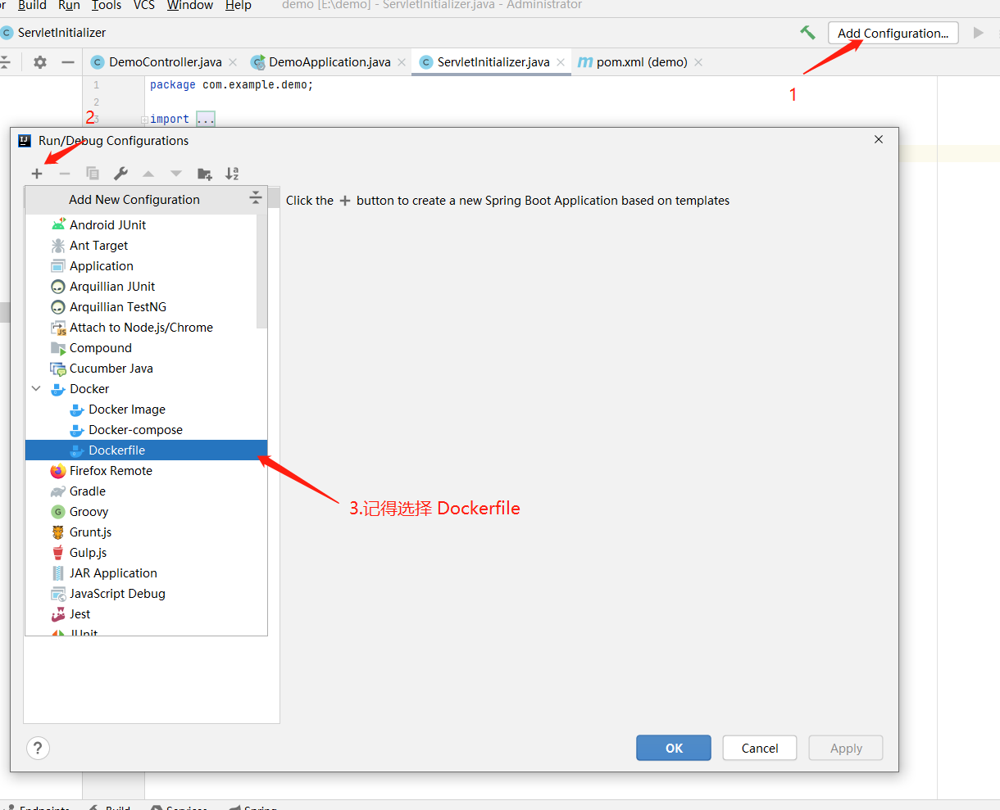


### 2.配置docker远程地址

打开配置界面如下，我们下拉 Server 选择 Create new...，其他的先别管，下面再说：

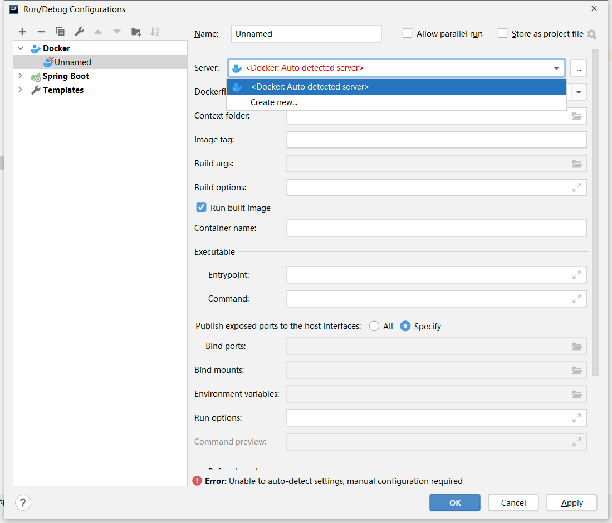


接着配置远程服务地址，注意，前面说到如果 Docker 开启安全远程访问，即在生产中，则要在下方配置证书位置，如果只是自己测试玩玩，只需配置上一项即可，点 OK 保存。

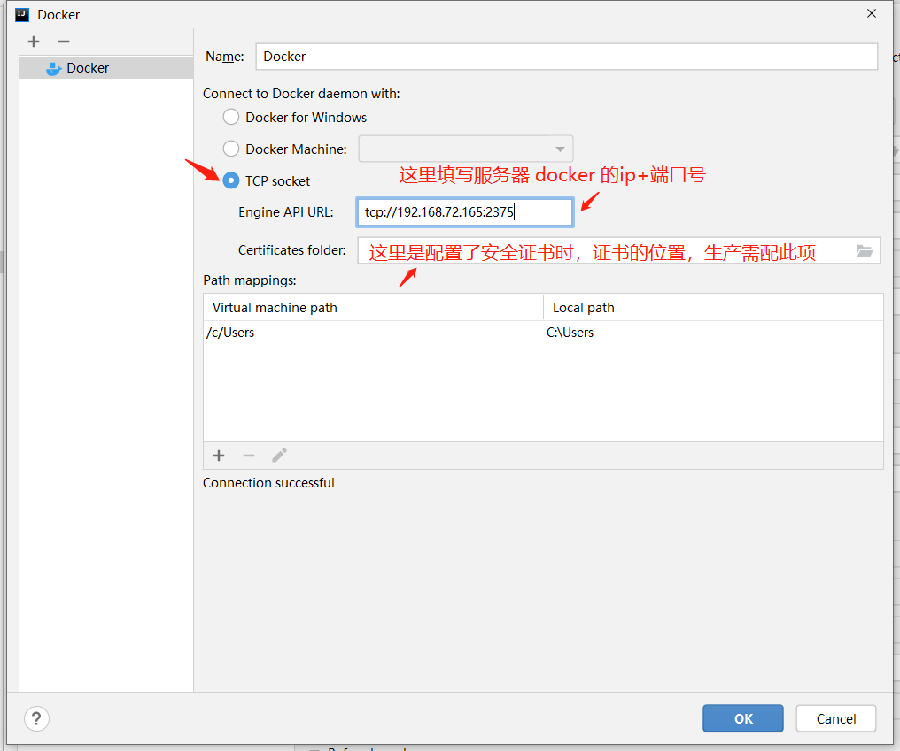


## 四.编写DockerFile

### 1.新建 Dockerfile 文件

上面先配完远程地址，我们先来写 Dockerfile，在项目根路径下新建文件，名称为 Dockerfile，内容如下：

```dockerfile
#基础镜像
FROM tomcat:latest
#作者信息
MAINTAINER grallcd@gmail.com
#定义变量，具体路径可以自行启动一个测试容器然后进入进行查看
ENV DIR_WEBAPP /usr/local/tomcat/webapps/
#添加本地的war包到远程容器中
ADD ./target/demo.war $DIR_WEBAPP
#配置工作目录
WORKDIR /usr/local/tomcat/webapps
#暴露端口
EXPOSE 8080
#启动tomcat
CMD ["catalina.sh", "run"]

```

- 说明：

  1. FROM 为基础镜像，我们要运行 war 包，最起码需要一个 tomcat ，此处为简便，选择了 latest 最近版本的
  2. MAINTAINER 为维护者信息，一般填写 Dockerfile 的制作人
  3. ENV 相当于一个变量，下方如果多处用到则可用该变量替换
  4. ADD 是将本地打出的 war 包复制到 tomcat 容器中的 webapps 目录下，注意名称为 demo.war ,上面有说到，打包后的包名即为 demo.war
  5. WORKDIR 为进入容器时的目录，即用 `docker exec ` 进入容器后，再 `pwd` 则是在该目录
  6. EXPOST为容器暴露的端口号
  7. CMD 则是启动容器的命令

### 2.完善配置

现在再回过头看 docker 配置项：

**需要注意的是**：我们在 Dockerfile 中写的 ADD 语句是将 war 包丢入容器内，但是这需要我们有个 war 包，因此在配置最下方 Before launch 中添加打 war 包的任务。

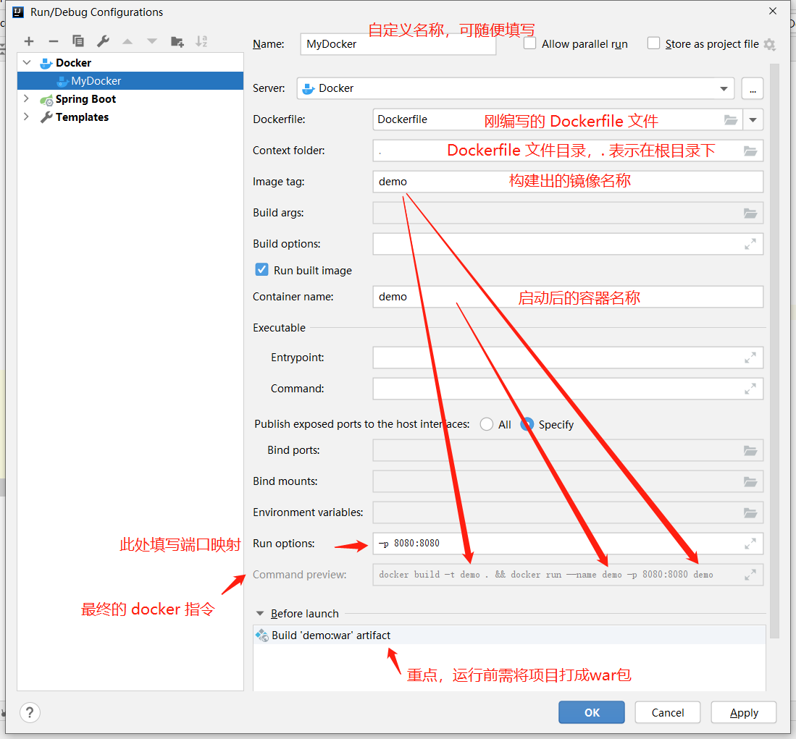


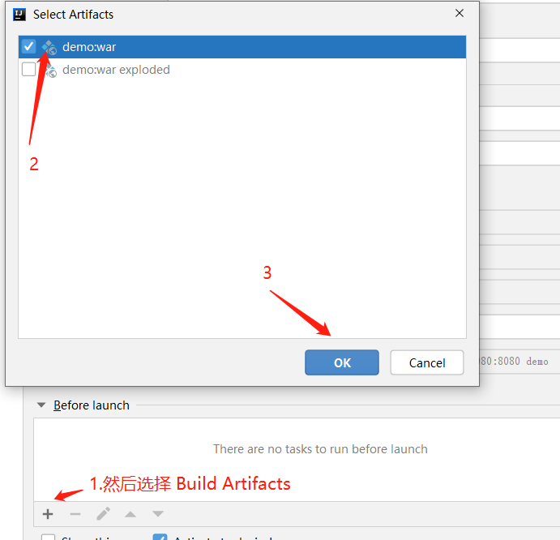


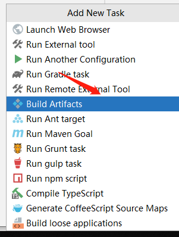


## 五.一键部署

### 1.构建镜像

构建完成后，可以在下方看到该镜像的构建过程，并且各个选项卡可以看到该容器内的日志及各种配置等：

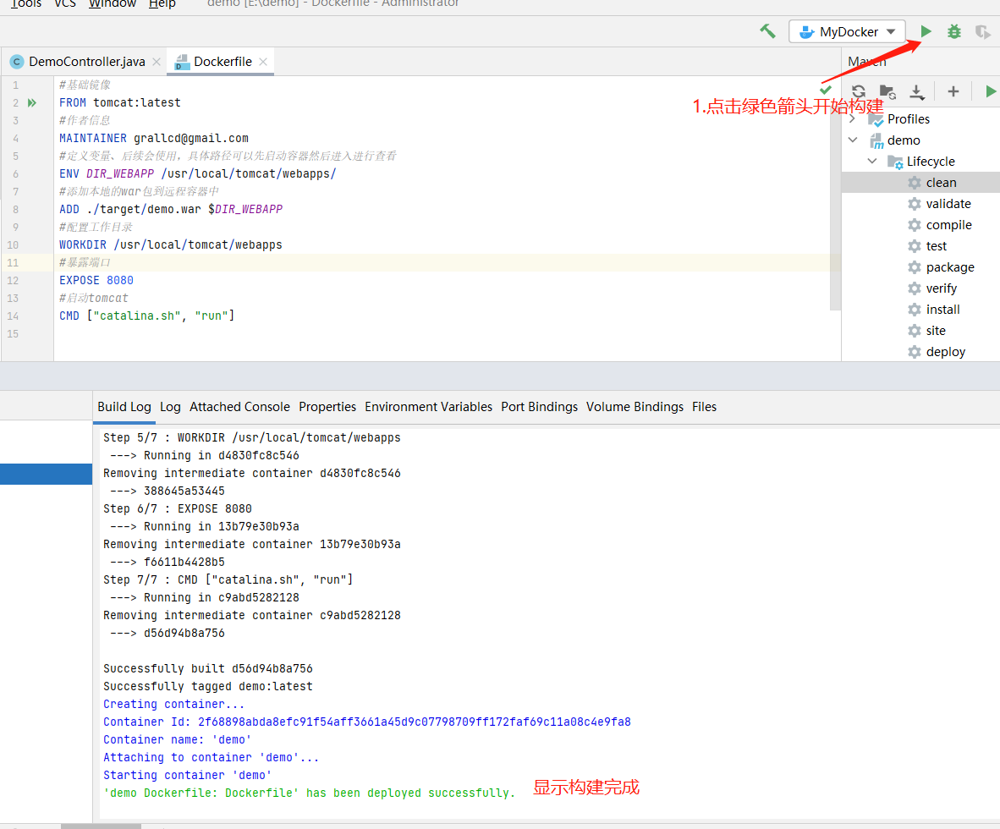


### 2.测试

打开浏览器，输入ip+端口号，中间加了 demo 是因为项目名称（即 war 包名称为 demo）：

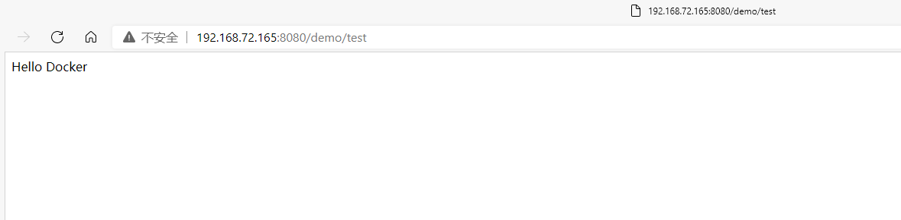


### 3.查看镜像及容器

可以看到服务器中已经有 demo 镜像了，并且已成功启动了容器：

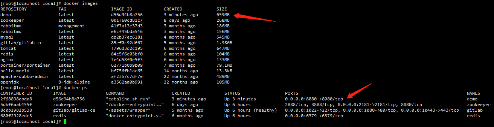