[TOC]

# JVM浅析之GC篇


## 简介

我们知道，java和C++不同之处有一点在于，C++需要手动进行内存的管理，而java因为有了JVM的存在，可以自动进行内存管理。尽管如此，还是会出现内存溢出or内存泄漏的情况，这时候，如果不了解JVM内存原理的话，可能会无从下手。你可以说自己是一名初级程序员，不必知道这些，抑或是工作中也用不上。但是，这是进阶高级程序员所必备的知识，况且能在面试官前侃侃而谈，也能加分不少。


在学习GC调优之前，必须了解的是：

1. 多数的 Java 应用不需要在服务器上进行 GC 优化。在调优之前，请先优化你的代码。只有出现内存泄漏或溢出时，需检查虚拟机各配置是否合理，这需要监控线上环境，经过不断的调整，才能找出最合理的配置。即GC优化永远是最后一项任务。

2. GC（Garbage Collection，垃圾收集），通过**GC收集器**，根据一定的**收集策略**自动回收内存，保证JVM的内存空间，防止内存泄漏or溢出。GC调优是为了什么？GC调优是为了合理分配内存空间，减少FULL GC的次数，从而减少STW（Stop The World），即用户线程的停顿时间。


## JVM运行时数据区组成

首先我们得知道 JVM 的内存管理机制及内存区域的组成，下面是一张经典的数据区域组成图：

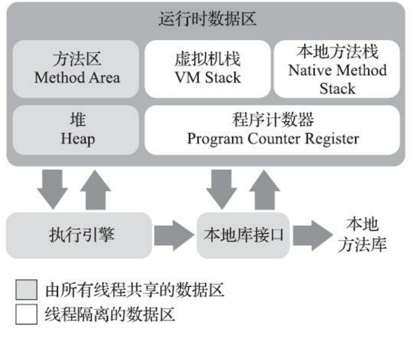

- 程序计数器（PC寄存器）：线程私有，不会发生内存溢出现象，为了使线程切换后能够恢复到之前执行指令的位置。
- 虚拟机栈：线程私有，每调用一个方法，则会在该处创建一个栈帧并压栈，执行完后便出栈。栈帧用于存储局部变量表、操作数栈、动态连接、方法出口等。可能会抛出 StackOverflowError 或 OutOfMemoryError 。
- 本地方法栈：同虚拟机栈，不过本地方法栈是为虚拟之执行 native 方法服务，而虚拟机栈是为 java 方法服务。HotSpot虚拟机将本地方法栈与虚拟机栈合二为一了。
- 堆：线程共享，GC的主要区域，大多数对象都在此分配内存，极少数会有栈上分配。因分代收集理论，堆区域可分为年轻代和老年代，年轻代又包括2个Surviver 区和一个 Eden 区。
- 方法区：主要存储类型信息、常量、静态变量等，JDK8以前，HotSpot 对此处的实现是永久代，之后用在本地内存实现的元空间（Metaspace）代替。


**另**：Metaspace 由 Klass Metaspace 和 NoKlass Metaspace 组成：

- Klass Metaspace 是用来存 class 文件在 jvm 里的运行时数据结构信息的，默认放在**Compressed Class Pointer Space**中，是连续内存，紧接 Heap。
- NoKlass Metaspace 是专门来存 klass 相关的其他的内容，比如 method，constantPool 等，可以由多块不连续的内存组成，在本地内存中分配。


## 垃圾收集算法

目前的大部分虚拟机，都遵循了**分代收集理论**，将空间划分为年轻代、老年代和永久代，根据各区域对象熬过的 GC 次数，各代也有不同的垃圾收集算法。

### 标记-复制（Copying）

将内存划分为2块相等的区域，每次只使用其中一块，GC 一次就将存活的对象复制到另一区域中，把原来使用的内存空间则一次性清理，新生代一般采用这种收集算法，将内存区分为了一个 Eden 区和2个 Survivor 区（To 和 From）。不用考虑内存碎片问题，而缺点是内存会缩小为原来的一半。

### 标记-清除（Mark-Sweep）

先标记所有需回收的对象，接着统一回收被标记的对象，缺点有二：一是执行效率问题，当堆中有大量对象时，需进行大量的**标记与清除**操作；二是清除之后会有不连续的空间，产生空间碎片，不利于大对象的分配。

### 标记-整理（Mark-Compact）

标记-整理算法是在标记-清除上进行改进的，原来在清除之后会产生大量的空间碎片，而标记-整理在标记后并不直接清除，而是将存活的对象都往一端**移动**，然后直接清理掉边界之外的对象，这样剩下的就是一片连续的空间了。


- 标记-清除与标记-整理区别：

  标记-清除不需移动对象，会产生空间碎片问题，在内存分配上更加复杂，且内存分配频率要比垃圾收集频率高，因此在一定程度上会影响到系统的吞吐量，但是收集时停顿时间会更短。

  标记-整理需要移动对象，在回收时会更加复杂，因此停顿时间会更长，但系统整体的吞吐量会更大。

  所以更加关注吞吐量的 Parallel Scavenge 是基于标记-整理算法的，而关注延迟的 CMS 收集器则是基于标记-清除算法的。
  

  


## 垃圾收集器详解

首先得知道，衡量垃圾收集器的三项重要指标：内存占用（Footprint）、吞吐量（Throughput）和延迟（Latency），类似于 CAP 理论，吞吐量和延迟只能选择其中之一，二者不可兼得，要想有较低延迟，必须会损失一部分吞吐量。

当堆内存增大，GC 一次能处理的数量变大时，吞吐量大，但是 GC 一次的时间会变长，导致后面排队的线程等待时间变长；相反，如果堆内存小，GC 一次时间短，排队等待的线程等待时间变短，延迟减少，但一次请求的数量就会变小。
$$
吞吐量=运行用户代码时间 /(运行用户代码时间 + 运行垃圾收集时间)
$$


### Serial 

- 说明：用于新生代，基于标记-复制算法，单线程，简单且高效，无线程交互开销，VM 在 Client 模式下的默认收集器。
- 参数：`-XX:+UseSerialGC` 开启 Serial 收集器

### ParNew 

- 说明：用于新生代，基于标记-复制算法，Serial 的多线程版本，单 CPU 环境比不上 Serial，存在线程交互开销，但是，在 JDK 7 之前，除了 Serial 外，只有ParNew 能与 CMS 配合使用。JDK 9 之后，ParNew 合并入 CMS 收集器。

- 参数：`-XX:+UseParNewGC` 开启 ParNew 收集器		
  
  ​			`-XX:ParallelGCThreads` 限制线程数量

### Parallel Scavenge

- 说明：用于新生代，基于标记-复制算法，多线程，更加关注吞吐量。同时还有自适应调节策略，-XX: +UseAdaptiveSizePolicy ,当此参数被激活时，无需人工指定 -Xmn、-XX: SurvivorRatio、-XX: PretenureSizeThreshold 等细节参数，JVM 会动态调整。

- 参数：`-XX: MaxGCPauseMillis` 控制最大垃圾收集停顿时间

  ​			`-XX: GCTimeRatio` 直接设置吞吐量大小

### Serial Old

- 说明：Serial 的老年代版本，单线程，基于标记-整理算法。主要给 Client 模式下的 VM 使用。JDK 5 之前与 Parallel Scavenge 收集器搭配使用。

### Parallel Old

- 说明：Parallel Scavenge 的老年代版本，支持多线程并发收集，基于标记-整理算法，JDK 6 开始提供，注重吞吐量以及CPU资源敏感的场合，优先考虑Parallel Scavenge + Parallel Old收集器。适合吞吐量优先。

### CMS

- 说明：基于标记-清除算法，包括以下4个步骤：

  1. 初始标记（CMS initial mark） ：标记 GC Roots 能直接关联到的对象，需要 STW（Stop The World）。

  2. 并发标记 （CMS concurrent mark）：从 GC Roots 的直接关联对象开始遍历整个对象图，可并发进行。

  3. 重新标记 （CMS remark）：基于**增量更新**修正并发标记期间，因用户线程继续运作而导致标记产生变动的那一部分记录，也需 STW 。

  4. 并发清除（CMS concurrent sweep）：清理删除掉标记阶段判断的已经死亡的对象，可并发进行。
  
  CMS 虽然可并发收集、低停顿。然而有三个缺点：对处理器资源敏感，会占用一部分线程而导致应用程序变慢，降低吞吐量；同时无法处理浮动垃圾（Floating Garbage），在并发标记、并发清理时，用户线程还是运行的，因此会不断产生新的垃圾，需留待下一次再清理；因基于标记-清理，因此会有空间碎片的产生。
  
- **增量更新（Incremental Update）**：**三色标记**[^1]中解决并发扫描时的对象消失问题的一种解决方案。

- 参数：`-XX::+UseCompactAtFullCollection` 默认开启，JDK 9 开始废弃，用于 CMS 收集器要进行 Full GC 时开启内存碎片合并整理过程，非并发过程。

  ​			`-XX:CMSFullGCsBeforeCompaction` 用于设置执行多少次不压缩的 Full GC后，紧接着一次带压缩的（默认为0，表示每次进入Full GC时就进行碎片整理）

### G1（Garbage First）

- 说明：面向局部收集和基于 Region 的内存布局（把连续 Java 堆划分为多个大小相等的独立区域），同时还有 Humongous Region 区域，用来存储大对象（大小超过了一个 Region 容量一半的对象）。以关注延迟为目标，可指定最大停顿时间。面向服务端应用，JDK 9 开始取代 Parallel Scanvenge + Parallel Old 成为服务端默认垃圾收集器。整体上基于标记-整理，从局部上看基于标记-复制。

  主要包含以下4个阶段：

  1. 初始标记：标记 GC Roots 能直接关联到的对象，需停顿线程（耗时较短），无额外停顿。
  2. 并发标记：从 GC Roots 开始进行可达性分析，可与用户线程并发执行。
  3. 最终标记：对用户线程做一个短暂的暂停，用于处理并发阶段结束后仍遗留下来的 **SATB** 记录。
  4. 筛选回收：把要回收的 Region 中存活的对象复制到空的 Region 中，再清理旧的 Region。需移动存活对象，暂停用户线程，多条线程**并行**完成。

  虽然可以指定最大停顿时间，并且不会产生内存碎片，然而需要**记忆集**（通过写屏障实现）来记录跨代之间的引用关系，需占用大量内存，且维护成本也较高。

- **记忆集**：一种用于记录从非收集区域指向收集区域的指针集合的抽象数据结构，为解决对象跨代引用所带来的问题，避免了把整个老年代加入 GC Roots 扫描范围。

- **原始快照（Snapshot At the Beginning，SATB）**：**三色标记**[^1]中解决并发扫描时的对象消失问题的一种解决方案。

- 参数：`-XX:+UseG1GC` 开启G1垃圾收集器

  ​			`-XX:G1HeapRegionSize` 设置单个 Region  的大小（1MB~32MB），且应为2的N次幂

  ​			`-XX:MaxGCPauseMillis` 设置允许的收集停顿时间（默认200ms）

### ZGC

- 说明：JDK 11 引入，基于 Region 内存布局（可动态创建或销毁），使用**读屏障**、**染色指针**和**内存多重映射**等技术实现**可并发标记-整理**算法，以低延迟为首要目标的一款垃圾收集器，暂未设置年龄分代。

  ZGC 主要包含以下4个阶段，都可并发执行：

  1. 并发标记 （Concurrent Mark）：做可达性分析，更新染色指针上的标志位。
  2. 并发预备重分配 （Concurrent Prepare for Relocate）：统计需清理的 Region 组成重分配集（Relocation Set）（不同于 G1 的记忆集，记忆集需维护成本，而 ZGC 每次回收会扫描所有Region，用扫描成本替代了记忆集的维护成本）。
  3. 并发重分配 （Concurrent Relocate）：将 RS 中的存活对象复制到新的 Region 上，并为 RS 中的每个 Region 维护一个转发表（Forward Table），记录从旧对象到新对象的转向关系，**当此时用户线程并发访问旧对象，因染色指针的支持，从引用上就能知道该对象是否在 RS 中，如果在，同时由于读屏障，该访被截获，可以立即根据转发表将访问转发到新的对象并修正该引用的值（直接指向新对象），这也称为指针的自愈**。并且因为存在染色指针，当 RS 中的存活对象都复制完毕后，该 Region 即可立即释放（转发表还得留着）。（读屏障、写屏障可以理解为对象访问的 ”AOP“ 操作。）
  4. 并发重映射（Concurrent Remap）：修正整个堆中指向重分配集中旧对象的所有引用。主要目的是清理旧的引用，顺带释放转发表。因为指针“自愈”情况，并发重映射并不一定要执行，ZGC 巧妙地将并发重映射合并到了下一次 GC 时地并发标记阶段里去完成。

  

  另：并发重分配阶段，指针“自愈”只有第一次访问旧对象会转发，而 Shenandoah 的 转发指针（Brooks Pointer）每次访问时都会有开销，因此 ZGC 对用户程序的运行时负载要比 Shenandoah 低一些。

  

  优点是：1.通过染色指针的**“自愈”**特性，能够快速释放和重用 Region（只需该 Region 的存活对象被移走，而不必像 Shenandoah 一样需将整个堆中所有指向该 Region 的对象的引用都被修正）；2.只使用了读屏障，无需使用写屏障维护记忆集（不仅归功于染色指针，同时还因为 ZGC 目前不支持分代收集，无跨代引用）；3.染色指针可作为扩展性的存储结构将来存储其他对象标记、重定位相关的数据。

  缺点：尽管有如上优点，但是不分代的选择也限制了 ZGC 能承受的对象分配速率，每次都需要全堆扫描，容易产生浮动垃圾，只能等到下次回收。因此需要尽可能地增大堆的容量

  

- **染色指针（Colored Pointer）**：HotSpot 虚拟机标记方案的一种，指将标记信息记录在引用对象的指针上（ZGC 使用此种方式）。另外两种是：1.将标记直接记录在对象头（对象的哈希码、GC 分代年龄则记录在此）上（Serial 收集器）；2.将标记信息记录在与对象相互独立的数据结构上（G1、Shenandoah 用堆内存 1/64 大小，被称为 BitMap 的结构来记录）。因此，用染色指针时，可达性分析不用遍历对象图，只需遍历该指针引用即可标记了。

- **内存多重映射（Multi-Mapping）**：因染色指针重新定义了内存指针的其中4位，操作系统不一定支持，为了处理器的正常寻址，把染色指针中的标志位看作地址的分段符，将多个不同的虚拟内存地址映射到同一个物理内存地址上，经过多重映射转化，即可正常寻址了。

- 参数： `-XX:+UnlockExperimentalVMOptions -XX:+UseZGC` 开启 ZGC（JDK 11 及以上版本）（因 ZGC 目前是实验性，因此使用需先解锁，下面 Shenandoah 同理）

### Shenandoah

- 说明：同 G1 一样基于 Region 堆内存布局，有用于存放大对象的 Humongous Region，默认回收策略是优先处理回收价值最大的 Region。但默认不使用分代收集理论，即不会有专门的新生代 Region 或老年代 Region；**支持并发的整理算法**；使用连接矩阵（Connection Martrix）取代 G1 中的记忆集来记录跨 Region 的引用关系，降低了记忆集维护的消耗，内存和计算成本低。保证了收集垃圾的低延迟。

  主要包含9个阶段：

  1. 初始标记 （Initial Marking）：同 G1，标记与 GC Roots 直接关联的对象，需 STW，停顿时间与堆大小无关，只与 GC Roots 的数量相关。
  2. 并发标记 （Concurrent Marking）：遍历对象图，标记全部可达的对象，与用户线程并发执行。
  3. 最终标记 （Final Marking）：处理剩余的 SATB 扫描，并统计出回收价值最高的 Region，将这些 Region 构成回收集（Collection Set），会有一小段短暂的暂停。
  4. 并发清理  （Concurrent Cleanup）：清理那些整个区域内连一个存活对象都没有的 Region（也称为 Immediate Garbage Region）。
  5. **并发回收** （Concurrent Evacuation）：把回收集中的存活对象先复制一份到未使用的 Region 中，因与用户线程并发执行，用户线程可能不停地访问对象，移动后很难瞬间将全部旧引用地址指向新的引用地址，Shenandoah 通过**转发指针（Brooks Pointers）**和**读屏障**来解决该问题。
  6. 初始引用更新 （Initial Update Reference）：建立一个线程集合点，确保所有并发回收阶段中进行的收集器线程都已完成上一步中移动对象的任务。会产生一个短暂的停顿。
  7. 并发引用更新 （Concurrent Update Reference）：开始进行引用更新操作，将并发回收中的旧地址改为新地址。
  8. 最终引用更新（Final Update Reference）：解决引用更新后，还要修正存在于 GC Roots 中的引用，这是 Shenandoah 的最后一次停顿。
  9.  并发清理（Concurrent Cleanup）：通过并发回收和引用更新后，整个回收集中的所有 Region 已无存活对象，最后再调用一次并发清理回收内存空间。

  其中**初始标记、最终标记、初始引用更新**仍需进行短暂的 “Stop The World”，而**并发标记、并发回收、并发引用更新**则真正实现了用户线程和 GC 线程并发执行（G1 的回收阶段只是并行）。

  

- **转发指针（Brooks Pointers）**：在原有对象布局结构的最前面统一增加一个新的引用字段，在正常不处于并发阶段时，该引用指向对象自己。当对象有了一份新的副本时，只需修改一处指针的值，将旧对象上转发指针的引用位置指向新对象。有点类似于早期 JVM 使用的句柄定位，差别在于句柄通常存储在句柄池中，而转发指针则分散在每一个对象头前面。且每次访问对象时会有一次转向开销。

  另外，转发指针会出现并发问题，即如果用户并发写入，必须保证写操作只能发生在新复制的对象上，而不是写入到旧的对象中，实际上 Shenandoah 通过 CAS 操作来保证并发时对象的访问正确性。同时，Shenandoah 使用了读写屏障，对执行效率也会有一定的影响。

- 参数：`-XX:+UnlockExperimentalVMOptions -XX:+UseShenandoahGC`   开启 Shenandoah GC

------

[^1]: 三色标记是 GC 线程进行可达性分析时，遍历对象图的一种辅助方法，当用户线程和收集器并发工作时，用户线程可能会修改对象引用关系从而导致收集器误标记对象的存活状态，进而引发严重的问题。而增量更新（Incremental Update）和原始快照（Snapshot At the Beginning，SATB）则是解决并发扫描时对象引用问题的两种解决方案。


## 基础故障分析命令

### jps：查看虚拟机进程状况

| 选项 |                             作用                             |
| :--: | :----------------------------------------------------------: |
|  -l  | 输出主类全名，如果是jar包，则输出包路径（第一列为进程号，后面都需用到） |
|  -v  |               输出虚拟机进程启动时的 JVM 参数                |
|  -m  |      输出虚拟机进程启动时传递给主类 main（）函数的参数       |

- `jps -l`查看虚拟机进程：

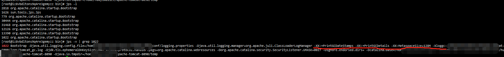


### jstat：查看虚拟机统计信息

|  选项   |                             作用                             |
| :-----: | :----------------------------------------------------------: |
|   -gc   | 监视 java 堆情况，包括 Eden 区、2个 Survivor 区、老年代、永久代等的容量，已用空间，垃圾收集时间合计等信息 |
| -gcutil | 监视内容与 -gc 基本相同，但输出主要关注已使用空间占总空间的百分比 |


- `jstat -gc 2083`

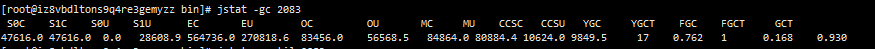

S0C：第一个幸存区的大小		S1C：第二个幸存区的大小

S0U：第一个幸存区的使用大小		S1U：第二个幸存区的使用大小

EC：伊甸园区的大小		EU：伊甸园区的使用大小

OC：老年代大小		OU：老年代使用大小

MC：方法区大小		MU：方法区使用大小

CCSC：压缩类空间大小		CCSU：压缩类空间使用大小

YGC：年轻代垃圾回收次数		YGCT：年轻代垃圾回收消耗时间

FGC：老年代垃圾回收次数		FGCT：老年代垃圾回收消耗时间

GCT：垃圾回收消耗总时间


- `jstat -gcutil 2083`

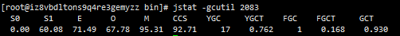

S0：幸存1区当前使用比例		S1：幸存2区当前使用比例

E：伊甸园区使用比例		O：老年代使用比例

M：元数据区使用比例		CCS：压缩使用比例

YGC：年轻代垃圾回收次数		FGC：老年代垃圾回收次数

FGCT：老年代垃圾回收消耗时间		GCT：垃圾回收消耗总时间


### jinfo：查看 java 配置信息

- `jinfo -flag MetaspaceSize 2083` 查看 MetaspaceSize 参数值（128M）


### jmap：java 内存映像工具

|  选项  |                             作用                             |
| :----: | :----------------------------------------------------------: |
| -heap  |                    显示 Java 堆的详细信息                    |
| -dump  | 当前路径生成 Java 堆转储快照，格式为 -dump:[live,]format=b,file=\<filename>,live 则表示只dump存活的对象 |
| -histo |       显示堆中对象统计信息，包括类、实例数量、合计容量       |

- `jmap -heap 29325 ` 查看进程 29325 的 java 堆详细信息 

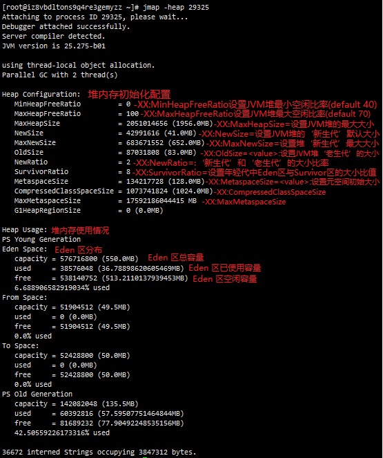


- `jmap -dump:live,format=b,file=heap.hprof 29325` 在当前路径生成 29325 进程的堆转储快照

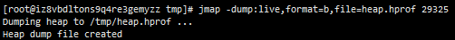

生成 heap.hprof 文件后，则可以拷贝出来，通过 IntelliJ IDEA 的 [Profiler 插件](https://www.jetbrains.com/help/idea/2020.3/analyze-hprof-memory-snapshots.html)分析该文件。


- `jmap -histo 29325 | head -n 30`查看堆内存中占用内存最多的前 30 个类实例

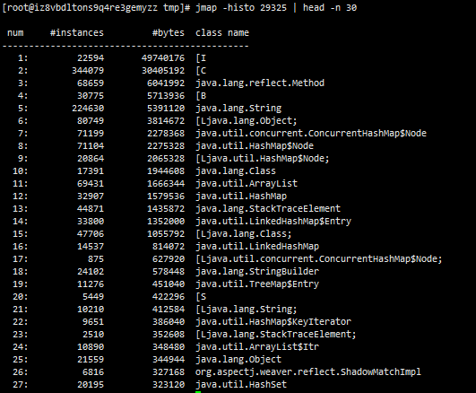


### jstack：java 堆栈跟踪工具


| 选项 |                     作用                     |
| :--: | :------------------------------------------: |
|  -F  | 当正常输出的请求不被响应时，强制输出线程堆栈 |
|  -l  |        除堆栈外，显示关于锁的附加信息        |
|  -m  |  如果调用到本地方法，可以显示 C/C++ 的堆栈   |

实际过程中可以通过调用 java.lang.Thread 中的 getAllStackTraces() 方法达到 `jstack -l` 的效果。


### jcmd：多功能工具

jcmd 是 JDK 1.7 之后新增的一个命令行工具，可用来导出堆、查看 java 进程、导出线程信息等。

首先可用 `jcmd -l` 列出当前运行的所有虚拟机：

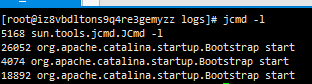


接着用`jcmd 26052 help`可列出该虚拟机支持的所有命令（查看进程26052的相关命令）：

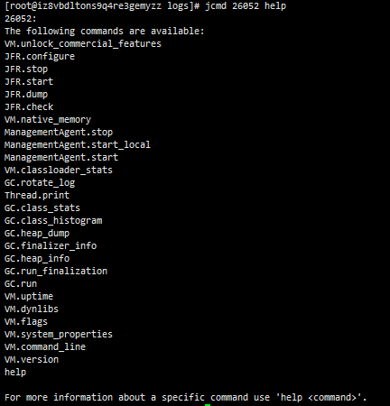

- `jcmd 26052 Thread.print` 打印堆栈信息

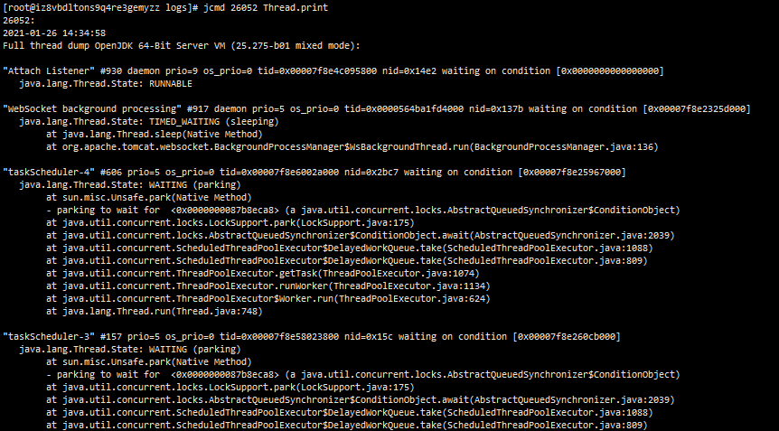

- `jcmd 26052 GC.heap_info` 查看GC 堆详细信息：

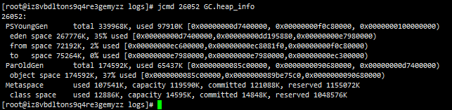

- `jcmd 26052 GC.heap_dump /tmp/heap.hprof` 导出堆信息：

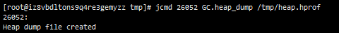

## 相关配置参数

### 堆参数

|             参数             |                             描述                             |
| :--------------------------: | :----------------------------------------------------------: |
|             -Xms             |              设置 JVM 启动时堆内存的初始化大小               |
|             -Xmx             |                      设置堆内存的最大值                      |
|             -Xmn             |                     设置年轻代的空间大小                     |
|         -XX:PermGen          |        设置永久代内存的初始化大小（1.8废弃了永久代）         |
|        -XX:MaxPermGen        |                      设置永久代的最大值                      |
|      -XX:SurvivorRatio       |        设置 Eden 区和 Survivor 区的空间比例，默认为8         |
|         -XX:NewRatio         |            设置老年代和年轻代的空间比例，默认为2             |
|      -XX:MetaspaceSize       |                       设置元空间的大小                       |
|     -XX:MaxMetaspaceSize     |                      设置元空间的最大值                      |
| -XX:CompressedClassSpaceSize | 设置 Klass Metaspace 空间大小（-Xmx 大于 32G 或没有开启压缩指针，则该参数无效） |


### 回收器参数

|          参数           |                         描述                          |
| :---------------------: | :---------------------------------------------------: |
|    -XX:+UseSerialGC     |          Serial + Serial Old，串行，复制算法          |
|   -XX:+UseParallelGC    | Parallel Scavenge + Parallel Old，并行，标记-整理算法 |
| -XX:+UseConcMarkSweepGC |           ParNew + CMS，并发，标记-清除算法           |
|      -XX:+UseG1GC       |            G1，并行，分 Region 区混合回收             |


### 其他参数

|                参数                |                   说明                    |
| :--------------------------------: | :---------------------------------------: |
|        -XX:+PrintGCDetails         |             打印 GC 详细信息              |
|       -XX:+PrintGCDateStamps       |     按照日期时间格式打印 GC 详细信息      |
| -XX:+PrintGCApplicationStoppedTime |        打印 GC 时，应用的停顿时间         |
|         -XX:+PrintHeapAtGC         |          每次 GC 前后打印堆信息           |
|  -XLoggc:/home/tomcat/logs/gc.log  | 将 GC 日志输出到 /home/tomcat/logs 目录下 |


## 附

1. 查看当前 JVM 相关信息：

```shell
java -XX:+PrintCommandLineFlags -version
```

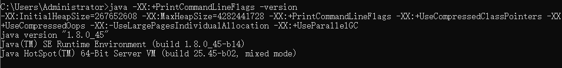

从图中可以看到：

`-XX:+UseParallelGC`，说明使用的是 Parallel Scavenge + Parallel Old 的组合。

`-XX:+UseCompressedClassPointers` 开启了压缩类指针

`-XX:+UseCompressedOops` 开启了压缩对象指针

  


